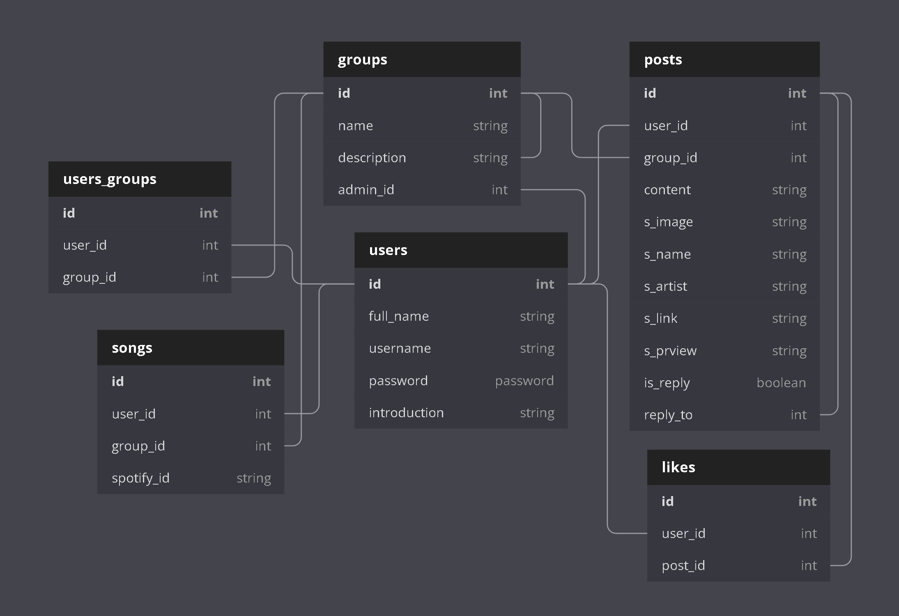
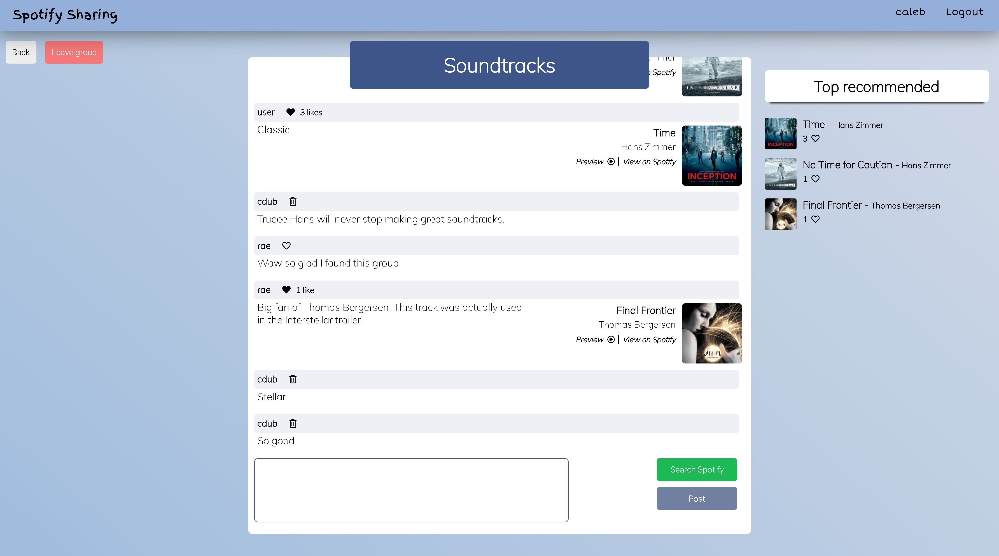
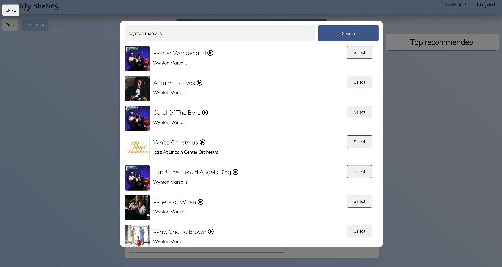
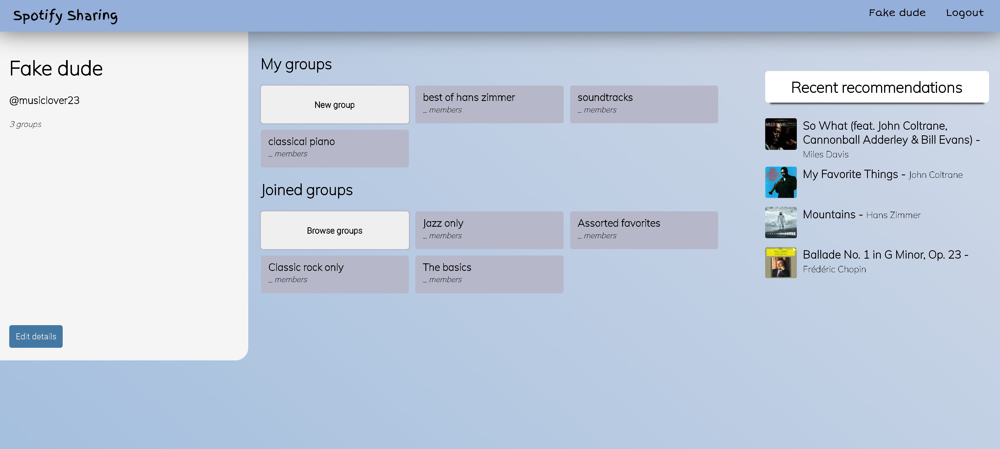

# Spotify Sharing

  

An app for sharing music with friends.

Built with Python, Flask, SQLAlchemy, PostgreSQL, HTML/Jinja, CSS, JavaScript.

This app makes use of [Spotify's web API](https://developer.spotify.com/documentation/web-api/).

Users can sign up and create and join groups. Groups are made up of a post feed, where users can share songs with each other. Posts are likeable and the most-liked songs will be displayed in a list on the group page.
 

## To get Started (💻 Dev)

 
Run in terminal:

- `git clone https://github.com/cwaymeyer/spotify-sharing.git` (clone repository)
- `cd spotify-sharing` (cd into folder)
- `python3 -m venv venv` (create virtual environment)
- `source ven/bin/activate` (activate virtual environment)
- `pip3 install -r requirements.txt` (install requirements)
- `createdb spotify-sharing` (create database) (`createdb spotify-sharing-test` for test db)
- `touch api_keys.py`
  > Inside of `api_keys.py`, set following variables:
  >
  > - `CLIENT_ID = {Client ID}`
  > - `CLIENT_SECRET = {Client Secret}`
  > 
  >   Both Client ID and Client Secret can be acquired through [Spotify's Web API](https://developer.spotify.com/documentation/general/guides/authorization/app-settings/)
- `flask run` (run application)

#### Testing

- To test application, run `python3 -m unittest discover tests/` from root directory
 

## Database Schema

 

(Database diagram created with [dbdiagram.io](https://dbdiagram.io/home))
 

## Demo Screenshots

 

